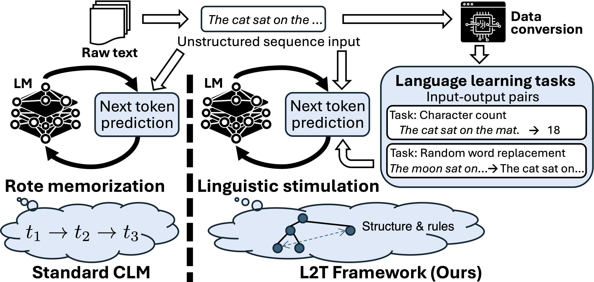

Enhancing Linguistic Competence of Language Models through Pre-training with Language Learning Tasks
===

This repository is an official implementation of the paper "Enhancing Linguistic Competence of Language Models through Pre-training with Language Learning Tasks".



> [!Note] 
> Throughout this repository, we use the following placeholders to refer to specific paths:
> - `$SCRATCH`: Refers to the scratch directory allocated for your user on the computing cluster.
> - `/path/to/l2t/repository`: Refers to the root directory of this repository.
> - `your_partition_name`: Refers to the specific partition name of the computing cluster you are using. Please replace this placeholder with the actual partition name when submitting jobs.
>
> We assume the access to high-performance computing clusters with either AMD or NVIDIA GPUs with Singularity/Apptainer installed and SLURM as the job scheduler. Please adjust the instructions accordingly if you are using a different setup.


## Installation
### For AMD GPUs
We create two separate environments: one for pre-training and another for evaluation.

**For pre-training**  
```bash
# Download the container (if not already done)
mkdir -p $SCRATCH/containers/
APPTAINER_CACHEDIR=$SCRATCH/containers/
export APPTAINER_CACHEDIR
apptainer pull --dir $SCRATCH/containers/ docker://rocm/pytorch:rocm6.3_ubuntu22.04_py3.10_pytorch_release_2.3.0
mkdir $DATA/containers

apptainer exec --fakeroot \
    --bind $SCRATCH:$SCRATCH \
    --rocm $SCRATCH/containers/pytorch_rocm6.3_ubuntu22.04_py3.10_pytorch_release_2.3.0.sif \
    /bin/bash

# Sanity checks
rocminfo
rocm-smi

# Set configurations
mkdir -p $SCRATCH/cache/
export TRANSFORMERS_VERBOSITY=debug
export HF_HOME=$SCRATCH/cache/
export HF_HUB_CACHE=$SCRATCH/cache/
export HF_DATASETS_CACHE=$SCRATCH/cache/
export HF_DATASETS_TRUST_REMOTE_CODE=true

# Create an env
mkdir -p $SCRATCH/envs/
python3 -m venv --system-site-packages $SCRATCH/envs/arr_2026_jan
source $SCRATCH/envs/arr_2026_jan/bin/activate

# Install packages
pip install transformers==4.49.0 datasets==3.6.0 peft==0.15.1 accelerate==1.6.0 scikit-learn==1.6.1 sentencepiece==0.2.1 tqdm protobuf tiktoken==0.12.0 nltk==3.9.2 zstandard==0.25.0 huggingface-hub blingfire
cd ~/src
git clone --depth 1 https://github.com/ROCm/flash-attention.git
cd flash-attention
MAX_JOBS=$((`nproc` - 1)) pip install -v . # This takes a super long time ~2 hours

deactivate
exit
exit
```

**For evaluation**  
```bash
# Download the container (if not already done)
mkdir -p $SCRATCH/containers/
APPTAINER_CACHEDIR=$SCRATCH/containers/
export APPTAINER_CACHEDIR
apptainer pull --dir $SCRATCH/containers/ docker://rocm/pytorch:rocm6.3_ubuntu22.04_py3.10_pytorch_release_2.3.0
mkdir $DATA/containers

apptainer exec --fakeroot \
    --bind $SCRATCH:$SCRATCH \
    --rocm $SCRATCH/containers/pytorch_rocm6.3_ubuntu22.04_py3.10_pytorch_release_2.3.0.sif \
    /bin/bash

# Sanity checks
rocminfo
rocm-smi

# Set configurations
mkdir -p $SCRATCH/cache/
export TRANSFORMERS_VERBOSITY=debug
export HF_HOME=$SCRATCH/cache/
export HF_HUB_CACHE=$SCRATCH/cache/
export HF_DATASETS_CACHE=$SCRATCH/cache/
export HF_DATASETS_TRUST_REMOTE_CODE=true

# Create an env
mkdir -p $SCRATCH/envs/
python3 -m venv --system-site-packages $SCRATCH/envs/arr_2026_jan
source $SCRATCH/envs/arr_2026_jan_eval/bin/activate

# Install packages
pip install transformers==4.49.0 datasets==3.6.0 peft==0.15.1 accelerate==1.6.0 scikit-learn==1.6.1 sentencepiece==0.2.1 tqdm protobuf tiktoken==0.12.0 nltk==3.9.2 zstandard==0.25.0 huggingface-hub blingfire
cd ~/src
git clone --depth 1 https://github.com/EleutherAI/lm-evaluation-harness
cd lm-evaluation-harness
pip install  ".[math,ifeval,sentencepiece]"
huggingface-cli login

deactivate
exit
exit
```

### For NVIDIA GPUs
For pre-training 1B models, we use the NVIDIA PyTorch container with CUDA support. We did not use NVIDIA GPUs for evaluation.

```bash
#!/bin/bash

# Download the container (if not already done)
mkdir -p $SCRATCH/containers/
APPTAINER_CACHEDIR=$SCRATCH/containers/
export APPTAINER_CACHEDIR
apptainer pull --dir $SCRATCH/containers/ docker://nvcr.io/nvidia/pytorch:25.04-py3

# Enable the CUDA environment
apptainer exec \
    --bind $SCRATCH:$SCRATCH \
    --nv $SCRATCH/containers/pytorch_25.04-py3.sif \
    /bin/bash

mkdir -p $SCRATCH/envs/
python3 -m venv --system-site-packages $SCRATCH/envs/arr_2026_jan
source $SCRATCH/envs/arr_2026_jan/bin/activate

# Install packages
unset PIP_CONSTRAINT
pip install transformers==4.49.0 datasets==3.6.0 peft==0.15.1 accelerate==1.6.0 scikit-learn==1.6.1 sentencepiece==0.2.1 tqdm protobuf tiktoken==0.12.0 nltk==3.9.2 zstandard==0.25.0 huggingface-hub blingfire

deactivate
exit
exit
```

## Pre-processing

Please use the following scripts to pre-process the data for different scenarios:

| Scenario | Script | Description |
|----------|--------|-------------|
| Disjoint | [script](./preprocessing/scripts/generate_l2t_training_data_disjoint.sh) / [Slurm script](./preprocessing/scripts/wrap_generate_l2t_training_data_disjoint.sh) | Pre-process data for the Disjoint scenario. Make sure to run this script with a shard index argument (0-22). |
| Shared | [script](./preprocessing/scripts/generate_l2t_training_data_shared.sh) / [Slurm script](./preprocessing/scripts/wrap_generate_l2t_training_data_shared.sh) | Pre-process data for the Shared scenario. Make sure to run this script with a shard index argument (0-7). |
| Baseline (Raw) | [script](./preprocessing/scripts/generate_ntp_training_data.sh) / [Slurm script](./preprocessing/scripts/wrap_generate_ntp_training_data.sh) | Pre-process data for the baseline (Raw). Make sure to run this script with a shard index argument (0-22). |

### Data for ablation studies

Please use the following scripts to pre-process the data for ablation studies:

| Ablation Study | Script | Description |
|----------------|--------|-------------|
| 100% L2T Data | [script](./preprocessing/scripts/mix-ratio/generate_l2t_training_data_mix_0.sh) / [Slurm script](./preprocessing/scripts/mix-ratio/wrap_generate_l2t_training_data_mix_0.sh) | Pre-process data for the 100% L2T data ablation study. Make sure to run this script with a shard index argument (0-22). |
| 75% L2T Data | [script](./preprocessing/scripts/mix-ratio/generate_l2t_training_data_mix_25.sh) / [Slurm script](./preprocessing/scripts/mix-ratio/wrap_generate_l2t_training_data_mix_25.sh) | Pre-process data for the 75% L2T data ablation study. Make sure to run this script with a shard index argument (0-22). |
| 25% L2T Data | [script](./preprocessing/scripts/mix-ratio/generate_l2t_training_data_mix_75.sh) / [Slurm script](./preprocessing/scripts/mix-ratio/wrap_generate_l2t_training_data_mix_75.sh) | Pre-process data for the 25% L2T data ablation study. Make sure to run this script with a shard index argument (0-22). |
| Single task (Char Count) | [script](./preprocessing/scripts/single-task/generate_char_count_training_data.sh) / [Slurm script](./preprocessing/scripts/single-task/wrap_generate_char_count_training_data.sh) | Pre-process data for the single task (Char Count) ablation study. Make sure to run this script with a shard index argument (0-5). |
| Single task (Masked Char) | [script](./preprocessing/scripts/single-task/generate_masked_char_training_data.sh) / [Slurm script](./preprocessing/scripts/single-task/wrap_generate_masked_char_training_data.sh) | Pre-process data for the single task (Masked Char) ablation study. Make sure to run this script with a shard index argument (0-5). |
| Single task (Space) | [script](./preprocessing/scripts/single-task/generate_space_training_data.sh) / [Slurm script](./preprocessing/scripts/single-task/wrap_generate_space_training_data.sh) | Pre-process data for the single task (Space) ablation study. Make sure to run this script with a shard index argument (0-5). |
| Single task (Typo) | [script](./preprocessing/scripts/single-task/generate_typo_training_data.sh) / [Slurm script](./preprocessing/scripts/single-task/wrap_generate_typo_training_data.sh) | Pre-process data for the single task (Typo) ablation study. Make sure to run this script with a shard index argument (0-5). |
| Single task (Last) | [script](./preprocessing/scripts/single-task/generate_last_training_data.sh) / [Slurm script](./preprocessing/scripts/single-task/wrap_generate_last_training_data.sh) | Pre-process data for the single task (Last) ablation study. Make sure to run this script with a shard index argument (0-5). |
| Single task (Masked Word) | [script](./preprocessing/scripts/single-task/generate_masked_word_training_data.sh) / [Slurm script](./preprocessing/scripts/single-task/wrap_generate_masked_word_training_data.sh) | Pre-process data for the single task (Masked Word) ablation study. Make sure to run this script with a shard index argument (0-5). |
| Single task (Random Word) | [script](./preprocessing/scripts/single-task/generate_random_training_data.sh) / [Slurm script](./preprocessing/scripts/single-task/wrap_generate_random_training_data.sh) | Pre-process data for the single task (Random Word) ablation study. Make sure to run this script with a shard index argument (0-5). |
| Single task (Shuffle) | [script](./preprocessing/scripts/single-task/generate_shuffle_training_data.sh) / [Slurm script](./preprocessing/scripts/single-task/wrap_generate_shuffle_training_data.sh) | Pre-process data for the single task (Shuffle) ablation study. Make sure to run this script with a shard index argument (0-5). |
| Single task (Token Type) | [script](./preprocessing/scripts/single-task/generate_token_type_training_data.sh) / [Slurm script](./preprocessing/scripts/single-task/wrap_generate_token_type_training_data.sh) | Pre-process data for the single task (Token Type) ablation study. Make sure to run this script with a shard index argument (0-5). |
| Single task (Deletion) | [script](./preprocessing/scripts/single-task/generate_deletion_training_data.sh) / [Slurm script](./preprocessing/scripts/single-task/wrap_generate_deletion_training_data.sh) | Pre-process data for the single task (Deletion) ablation study. Make sure to run this script with a shard index argument (0-5). |
| Single task (Reordering) | [script](./preprocessing/scripts/single-task/generate_reordering_training_data.sh) / [Slurm script](./preprocessing/scripts/single-task/wrap_generate_reordering_training_data.sh) | Pre-process data for the single task (Reordering) ablation study. Make sure to run this script with a shard index argument (0-5). |
| Single task (Fill Middle) | [script](./preprocessing/scripts/single-task/generate_fill_middle_training_data.sh) / [Slurm script](./preprocessing/scripts/single-task/wrap_generate_fill_middle_training_data.sh) | Pre-process data for the single task (Fill Middle) ablation study. Make sure to run this script with a shard index argument (0-5). |
| Single task (Half) | [script](./preprocessing/scripts/single-task/generate_half_training_data.sh) / [Slurm script](./preprocessing/scripts/single-task/wrap_generate_half_training_data.sh) | Pre-process data for the single task (Half) ablation study. Make sure to run this script with a shard index argument (0-5). |
| Single task (One) | [script](./preprocessing/scripts/single-task/generate_one_training_data.sh) / [Slurm script](./preprocessing/scripts/single-task/wrap_generate_one_training_data.sh) | Pre-process data for the single task (One) ablation study. Make sure to run this script with a shard index argument (0-5). |


## Pre-training

Please use the following scripts to pre-train the models for different scenarios:

| Scenario | Scale | Script | Description |
|----------|-------|--------|-------------|
| Disjoint | 1B | [script](./training/scripts/l2t_1b_disjoint.sh) / [Slurm script](./training/scripts/wrap_l2t_1b_disjoint.sh) | Pre-train 1B L2T model for the Disjoint scenario. |
| Disjoint | 500M | [script](./training/scripts/l2t_500m_disjoint.sh) / [Slurm script](./training/scripts/wrap_l2t_500m_disjoint.sh) | Pre-train 500M L2T model for the Disjoint scenario. |
| Shared | 1B | [script](./training/scripts/l2t_1b_shared.sh) / [Slurm script](./training/scripts/wrap_l2t_1b_shared.sh) | Pre-train 1B L2T model for the Shared scenario. |
| Shared | 500M | [script](./training/scripts/l2t_500m_shared.sh) / [Slurm script](./training/scripts/wrap_l2t_500m_shared.sh) | Pre-train 500M L2T model for the Shared scenario. |
| Baseline (Raw; Disjoint) | 1B | [script](./training/scripts/ntp_1b_disjoint.sh) / [Slurm script](./training/scripts/wrap_ntp_1b_disjoint.sh) | Pre-train 1B Raw model for the Baseline (Raw; Disjoint) scenario. |
| Baseline (Raw; Disjoint) | 500M | [script](./training/scripts/ntp_500m_disjoint.sh) / [Slurm script](./training/scripts/wrap_ntp_500m_disjoint.sh) | Pre-train 500M Raw model for the Baseline (Raw; Disjoint) scenario. |
| Baseline (Raw; Shared) | 1B | [script](./training/scripts/ntp_1b_shared.sh) / [Slurm script](./training/scripts/wrap_ntp_1b_shared.sh) | Pre-train 1B Raw model for the Baseline (Raw; Shared) scenario. |
| Baseline (Raw; Shared) | 500M | [script](./training/scripts/ntp_500m_shared.sh) / [Slurm script](./training/scripts/wrap_ntp_500m_shared.sh) | Pre-train 500M Raw model for the Baseline (Raw; Shared) scenario. |

### Ablation studies
Please use the following scripts to pre-train the models for ablation studies:
| Ablation Study | Scale | Script | Description |
|----------------|-------|--------|-------------|
| 100% L2T Data | 500M | [script](./training/scripts/mix-ratio/l2t_500m_mix_0.sh) / [Slurm script](./training/scripts/mix-ratio/wrap_l2t_500m_mix_0.sh) | Pre-train 500M L2T model for the 100% L2T data ablation study. |
| 75% L2T Data | 500M | [script](./training/scripts/mix-ratio/l2t_500m_mix_25.sh) / [Slurm script](./training/scripts/mix-ratio/wrap_l2t_500m_mix_25.sh) | Pre-train 500M L2T model for the 75% L2T data ablation study. |
| 25% L2T Data | 500M | [script](./training/scripts/mix-ratio/l2t_500m_mix_75.sh) / [Slurm script](./training/scripts/mix-ratio/wrap_l2t_500m_mix_75.sh) | Pre-train 500M L2T model for the 25% L2T data ablation study. |
| Single task (Char Count) | 500M | [script](./training/scripts/single-task/l2t_500m_char_count.sh) / [Slurm script](./training/scripts/single-task/wrap_l2t_500m_char_count.sh) | Pre-train 500M L2T model for the single task (Char Count) ablation study. |
| Single task (Masked Char) | 500M | [script](./training/scripts/single-task/l2t_500m_masked_char.sh) / [Slurm script](./training/scripts/single-task/wrap_l2t_500m_masked_char.sh) | Pre-train 500M L2T model for the single task (Masked Char) ablation study. | |
| Single task (Space) | 500M | [script](./training/scripts/single-task/l2t_500m_space.sh) / [Slurm script](./training/scripts/single-task/wrap_l2t_500m_space.sh) | Pre-train 500M L2T model for the single task (Space) ablation study. |
| Single task (Typo) | 500M | [script](./training/scripts/single-task/l2t_500m_typo.sh) / [Slurm script](./training/scripts/single-task/wrap_l2t_500m_typo.sh) | Pre-train 500M L2T model for the single task (Typo) ablation study. |
| Single task (Last) | 500M | [script](./training/scripts/single-task/l2t_500m_last.sh) / [Slurm script](./training/scripts/single-task/wrap_l2t_500m_last.sh) | Pre-train 500M L2T model for the single task (Last) ablation study. |
| Single task (Masked Word) | 500M | [script](./training/scripts/single-task/l2t_500m_masked_word.sh) / [Slurm script](./training/scripts/single-task/wrap_l2t_500m_masked_word.sh) | Pre-train 500M L2T model for the single task (Masked Word) ablation study. |
| Single task (Random Word) | 500M | [script](./training/scripts/single-task/l2t_500m_random.sh) / [Slurm script](./training/scripts/single-task/wrap_l2t_500m_random.sh) | Pre-train 500M L2T model for the single task (Random Word) ablation study. |
| Single task (Shuffle) | 500M | [script](./training/scripts/single-task/l2t_500m_shuffle.sh) / [Slurm script](./training/scripts/single-task/wrap_l2t_500m_shuffle.sh) | Pre-train 500M L2T model for the single task (Shuffle) ablation study. |
| Single task (Token Type) | 500M | [script](./training/scripts/single-task/l2t_500m_token_type.sh) / [Slurm script](./training/scripts/single-task/wrap_l2t_500m_token_type.sh) | Pre-train 500M L2T model for the single task (Token Type) ablation study. |
| Single task (Deletion) | 500M | [script](./training/scripts/single-task/l2t_500m_deletion.sh) / [Slurm script](./training/scripts/single-task/wrap_l2t_500m_deletion.sh) | Pre-train 500M L2T model for the single task (Deletion) ablation study. |
| Single task (Reordering) | 500M | [script](./training/scripts/single-task/l2t_500m_reordering.sh) / [Slurm script](./training/scripts/single-task/wrap_l2t_500m_reordering.sh) | Pre-train 500M L2T model for the single task (Reordering) ablation study. |
| Single task (Fill Middle) | 500M | [script](./training/scripts/single-task/l2t_500m_fill_middle.sh) / [Slurm script](./training/scripts/single-task/wrap_l2t_500m_fill_middle.sh) | Pre-train 500M L2T model for the single task (Fill Middle) ablation study. |
| Single task (Half) | 500M | [script](./training/scripts/single-task/l2t_500m_half.sh) / [Slurm script](./training/scripts/single-task/wrap_l2t_500m_half.sh) | Pre-train 500M L2T model for the single task (Half) ablation study. |
| Single task (One) | 500M | [script](./training/scripts/single-task/l2t_500m_one.sh) / [Slurm script](./training/scripts/single-task/wrap_l2t_500m_one.sh) | Pre-train 500M L2T model for the single task (One) ablation study. |


## Evaluation

Please use the following scripts to evaluate the models for different scenarios:

* L2T models: [script](./evaluation/scripts/l2t.sh) / [Slurm script](./evaluation/scripts/wrap_l2t.sh)
* Baseline (Raw) models: [script](./evaluation/scripts/raw.sh) / [Slurm script](./evaluation/scripts/wrap_raw.sh)


> [!Note]
> When running the evaluation scripts, please make sure to specify the correct model path as the first argument. For example, for evaluating the 1B L2T model trained in the Disjoint scenario, you would use:
> ```bash
> sbatch /path/to/l2t/repository/evaluation/scripts/wrap_l2t.sh $SCRATCH/models/l2t-1b-disjoint
> ```
> The corresponding evaluation results will be saved in `/path/to/l2t/repository/evaluation/logs/l2t/` directory.


## Model Checkpoints
We released the pre-trained model checkpoints on Hugging Face. Below is the list of available models:

| Model | Scenario | Scale | Hugging Face Link |
|-------|----------|-------|-------------------|
| L2T | Disjoint | 1B | [link](https://huggingface.co/l2t-project/l2t-1b-disjoint) |
| L2T | Disjoint | 500M | [link](https://huggingface.co/l2t-project/l2t-500m-disjoint) |
| L2T | Shared | 1B | [link](https://huggingface.co/l2t-project/l2t-1b-shared) |
| L2T | Shared | 500M | [link](https://huggingface.co/l2t-project/l2t-500m-shared) |
| Baseline (Raw) | Disjoint | 1B | [link](https://huggingface.co/l2t-project/raw-1b-disjoint) |
| Baseline (Raw) | Disjoint | 500M | [link](https://huggingface.co/l2t-project/raw-500m-disjoint) |
| Baseline (Raw) | Shared | 1B | [link](https://huggingface.co/l2t-project/raw-1b-shared) |
| Baseline (Raw) | Shared | 500M | [link](https://huggingface.co/l2t-project/raw-500m-shared) |
| Ablation: 100% L2T Data | 500M | [link](https://huggingface.co/l2t-project/l2t-500m-disjoint-mix_0) |
| Ablation: 75% L2T Data | 500M | [link](https://huggingface.co/l2t-project/l2t-500m-disjoint-mix_25) |
| Ablation: 25% L2T Data | 500M | [link](https://huggingface.co/l2t-project/l2t-500m-disjoint-mix_75) |
| Ablation: Single task (Char Count) | 500M | [link](https://huggingface.co/l2t-project/l2t-500m-char_count) |
| Ablation: Single task (Masked Char) | 500M | [link](https://huggingface.co/l2t-project/l2t-500m-masked_char) |
| Ablation: Single task (Space) | 500M | [link](https://huggingface.co/l2t-project/l2t-500m-space) |
| Ablation: Single task (Typo) | | 500M | [link](https://huggingface.co/l2t-project/l2t-500m-typo) |
| Ablation: Single task (Last) | 500M | [link](https://huggingface.co/l2t-project/l2t-500m-last) |
| Ablation: Single task (Masked Word) | 500M | [link](https://huggingface.co/l2t-project/l2t-500m-masked_word) |
| Ablation: Single task (Random) | 500M | [link](https://huggingface.co/l2t-project/l2t-500m-random) |
| Ablation: Single task (Shuffle) | 500M | [link](https://huggingface.co/l2t-project/l2t-500m-shuffle) |
| Ablation: Single task (Token Type) | 500M | [link](https://huggingface.co/l2t-project/l2t-500m-token_type) |
| Ablation: Single task (Deletion) | 500M | [link](https://huggingface.co/l2t-project/l2t-500m-deletion) |
| Ablation: Single task (Reordering) | 500M | [link](https://huggingface.co/l2t-project/l2t-500m-reordering) |
| Ablation: Single task (Fill Middle) | 500M | | [link](https://huggingface.co/l2t-project/l2t-500m-fill_middle) |
| Ablation: Single task (Half) | 500M | [link](https://huggingface.co/l2t-project/l2t-500m-half) |
| Ablation: Single task (One) | 500M | [link](https://huggingface.co/l2t-project/l2t-500m-one) |


## Pre-training Datasets
TBA

## License
This project is licensed under the MIT License. See the [LICENSE](./LICENSE) file for details.

## Citation
If you find this work useful in your research, please consider citing the following paper:
```
TBA
```
